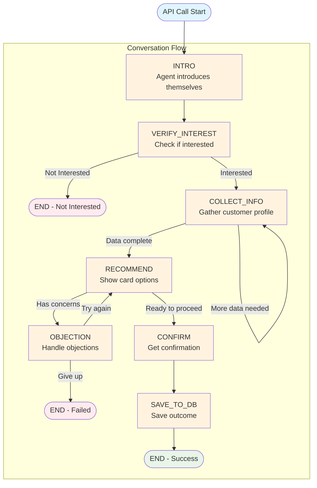

```mermaid
graph TD
    START([API Call Start]) --> INTRO

    subgraph "Conversation Flow"
        INTRO[INTRO<br/>Agent introduces themselves] --> VERIFY[VERIFY_INTEREST<br/>Check if interested]

        VERIFY -->|Not Interested| END1([END - Not Interested])
        VERIFY -->|Interested| COLLECT[COLLECT_INFO<br/>Gather customer profile]

        COLLECT -->|More data needed| COLLECT
        COLLECT -->|Data complete| RECOMMEND[RECOMMEND<br/>Show card options]

        RECOMMEND -->|Has concerns| OBJECTION[OBJECTION<br/>Handle objections]
        RECOMMEND -->|Ready to proceed| CONFIRM[CONFIRM<br/>Get confirmation]

        OBJECTION -->|Try again| RECOMMEND
        OBJECTION -->|Give up| END2([END - Failed])

        CONFIRM --> SAVE[SAVE_TO_DB<br/>Save outcome]
        SAVE --> END3([END - Success])
    end

    style START fill:#e1f5fe
    style END1 fill:#ffebee
    style END2 fill:#ffebee
    style END3 fill:#e8f5e8

    style INTRO fill:#fff3e0
    style VERIFY fill:#fff3e0
    style COLLECT fill:#fff3e0
    style RECOMMEND fill:#fff3e0
    style OBJECTION fill:#fff3e0
    style CONFIRM fill:#fff3e0
    style SAVE fill:#fff3e0
```